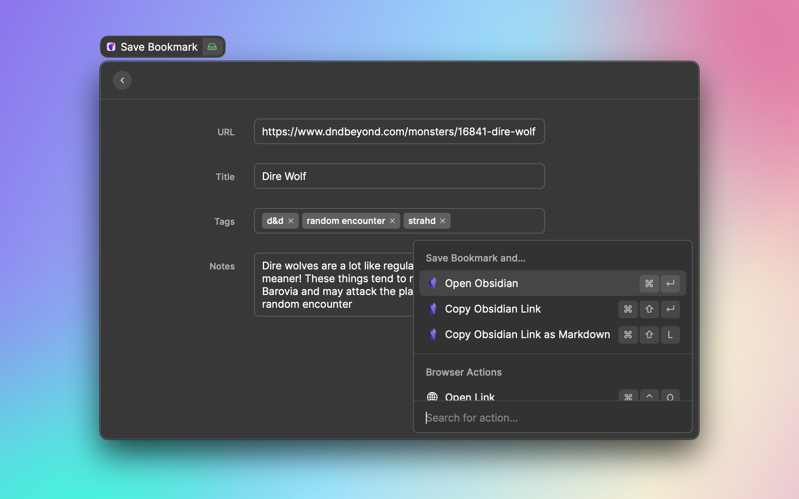
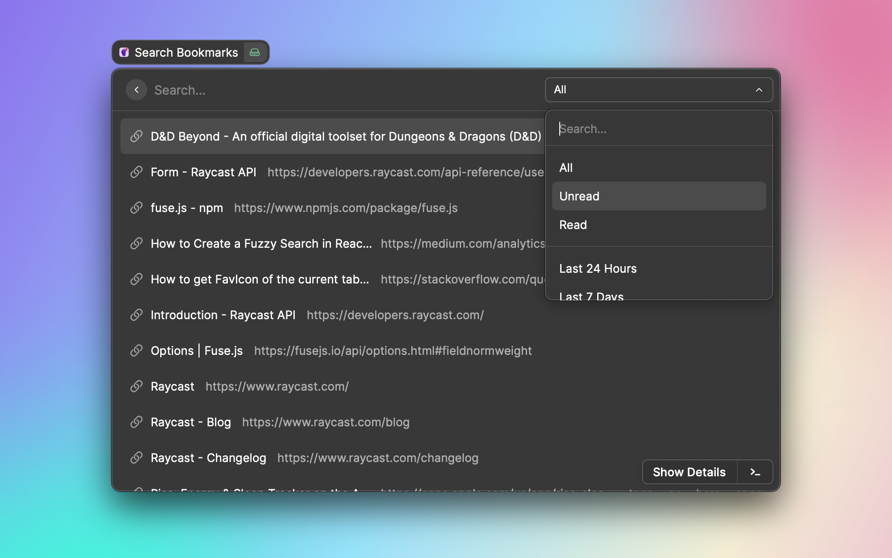

# Obsidian Bookmarks

> Manage your bookmarked links with Obsidian. Save, search, and access your bookmarks.

Obsidian Bookmarks lets you use Raycast and Obsidian as a place to manage your bookmarks.

Putting your bookmarks in Obsidian means that you can add your own metadata, including any notes or context about why you might be saving a link.

## Configuration

Obsidian Bookmarks supports the following preferences:

### Vault Path

The absolute path to your Obsidian vault. If you're storing the Vault in iCloud, this will be something like:

```
/Users/<name>/Library/Mobile Documents/iCloud~md~obsidian/Documents/<Vault>
```

### Bookmarks Subfolder

The subpath inside your vault where links should be saved to and searched from.

By default, bookmarks get saved into a folder called "Bookmarks" at the root level of your vault.

### Default Form Action

The default action to take whenever you save a new link to your bookmarks and press <kbd>⌘</kbd>+<kbd>⏎</kbd>.

If unchanged, the default action is "Open Obsidian", which will open the Obsidian app to your newly saved link. All possible options include:

- **Open Obsidian**: Open the obsidian app to your bookmark.
- **Copy Obsidian Link**: Copy the Obsidian link to your clipboard (as both rich and plain text).
- **Copy Obsidian Link as Markdown**: Copy the Obsidian link to your clipboard as a Markdown-style link.
- **Open Link**: Open the bookmarked link in your browser.
- **Copy Link**: Copy the bookmarked link to your clipboard (as both rich and plain text).
- **Copy Link as Markdown**: Copy the bookmarked link to your clipboard as a Markdown-style link.

### Default Item Action

The default action to take when browsing a list of your bookmarked links and you press <kbd>⏎</kbd>.

If unchanged, the default action is "Show Details", which will open a details panel view of your note in Obsidian.

See [Default Form Action](#default-form-action) for a list of other possible actions to pick from.

### Favicon Field

Search results show the favicon of each bookmarked website, falling back to a generic link icon when none can be found.

This preference names the frontmatter field used to override that favicon (default: `favicon`). Its value can either be another website, whose favicon is then used:

```yaml
---
title: "Some redirect"
source: "https://t.co/xxxxxxx"
favicon: "https://stripe.com"
---
```

...or a direct link to an image, which is used as-is. A value counts as an image when its path ends in `.png`, `.jpg`, `.jpeg`, `.gif`, `.svg`, `.webp`, `.ico`, `.bmp`, or `.avif`:

```yaml
favicon: "https://cdn.example.com/logos/acme.png"
```

The scheme is optional, so `favicon: notion.so` works too. Values that aren't `http(s)` URLs are ignored, and the icon falls back to the one derived from `source`.

Left blank, this preference falls back to `favicon`.

The **Save Bookmark** form exposes this as an optional "Favicon" dropdown. Type a URL into its search field and it becomes a selectable option, showing the icon it resolves to — so you can see the icon the bookmark will get before saving it. The first option always falls back to the bookmark's own URL.

Note that bookmarks are cached, so changing this preference (or an existing `favicon` value) only takes effect once the note is modified — run the **Clear Cache** command to refresh everything at once.

## Editing a Bookmark

The **Edit Bookmark** action (<kbd>⌘</kbd>+<kbd>E</kbd>) in your search results reopens the save form, prefilled from the note: its URL, title, favicon, tags and notes. **Update Bookmark** then writes your changes back to the same note.

The note keeps its filename, its original save date and its read state — only the fields shown in the form are rewritten, so Obsidian links to it keep working even if you change the title.

If the note starts with the `# [Title](url)` heading this extension generates, that heading is regenerated from the form and everything below it is what you edit in the "Notes" field. Notes you wrote yourself keep their body as-is.

## Smart Titles

Browser tab titles are inconsistent — "Project X | Figma", "GitHub - user/repo: description", sometimes no site name at all. When the save form prefills from your browser, the title is normalized to a consistent **"Site | Title"** shape: the site's name moves to the front wherever the page put it, and is added when missing but known from the page's Open Graph metadata. The Open Graph title (usually the clean, human-written one) replaces the tab title when the page provides it, and titles that already start with the site's name — landing-page taglines like "Vue.js - The Progressive JavaScript Framework" — are left as they are.

The site's human name ("GitHub") is picked up from the page's `og:site_name` at the same time and saved as the `publisher` frontmatter field, which search results show under each bookmark — so they read "GitHub" rather than "github.com". When the page names no site, the domain is used as before, and editing a bookmark keeps whatever its note already had. Nothing to fill in: the value is only ever read from the page or from the note.

The cleanup only ever touches the prefilled value — as soon as you edit any field, nothing is overwritten. Turn it off with the **Smart Titles** preference.

To bring your existing bookmarks in line, enable the **Normalize Bookmark Titles** command (it ships disabled, being a one-time migration tool — turn it on in the extension's settings): it previews every title the normalization would change (with the current title alongside), fetches missing site names from each page's metadata, and applies the renames one by one or all at once after confirmation. Your stored titles stay the base — the command reshapes them, it never re-titles notes from the web — and filenames are left untouched, so Obsidian links keep working.

## Sub-Bookmarks

Bookmarks can be grouped under another bookmark — handy for a tool with one page per project, for example. Pick a **Parent** in the save or edit form, or use **Save Sub-Bookmark** (<kbd>⌘</kbd>+<kbd>⇧</kbd>+<kbd>N</kbd>) on the parent to open the form with it preselected.

Sub-bookmarks stay listed with everything else, and their parent shows a counter in the search results and behaves like a folder: <kbd>Enter</kbd> (or **Show Sub-Bookmarks**, <kbd>⌘</kbd>+<kbd>⇧</kbd>+<kbd>B</kbd>) opens them in their own focused list, and your usual default action moves one row down in its action panel. Favoriting a sub-bookmark pins it to the favorites section like any other bookmark.

The relation lives in the note as a `parent` frontmatter field holding a wikilink (`parent: "[[note-name]]"`), so it shows up in Obsidian's graph and backlinks. Renaming or deleting the parent note simply makes its sub-bookmarks top-level again.

## Screenshots




